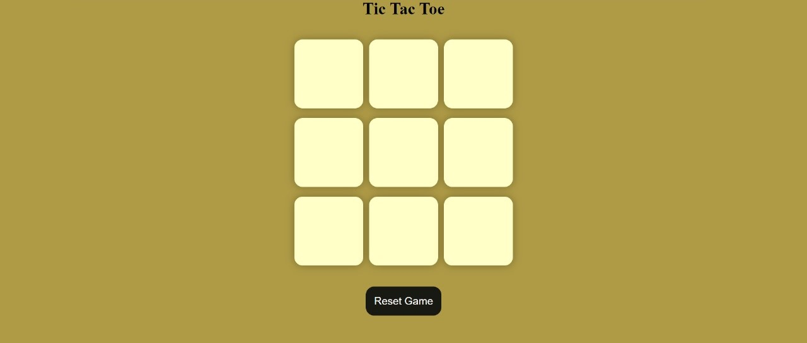
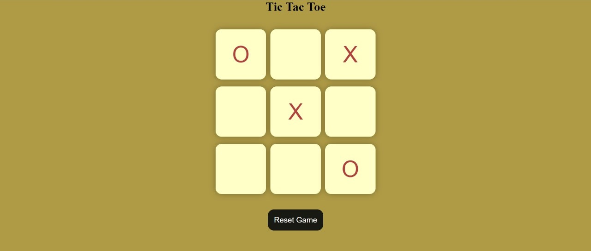
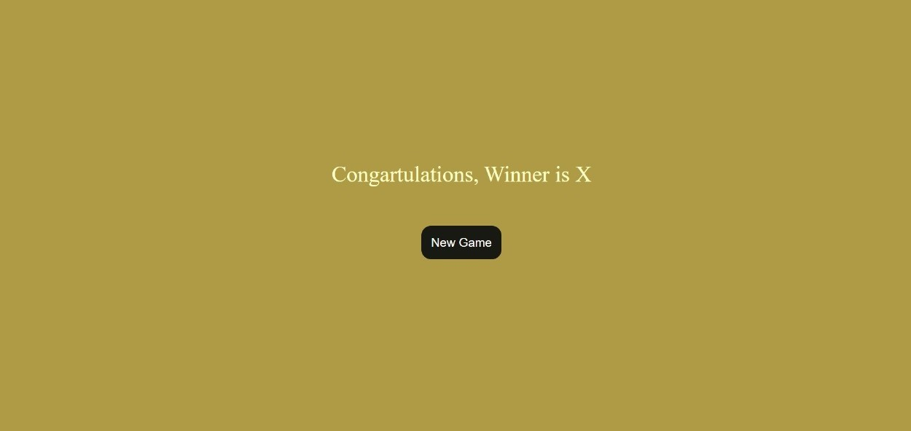

# Tic-Tac-Toe-Game

Tic-tac-toe is a game reminds us of so of our childhood. Here is the tech version of it. 
First it opens as a simple blank board consisting of boxes to be filled with user input. 

When each boxes are clicked upon "X" & "O" comes on the board alternatively proceeding the game.The moment a combination appears the respective user wins. 

This game is made using basic language : HTML, CSS and JavaScript by respective code.

